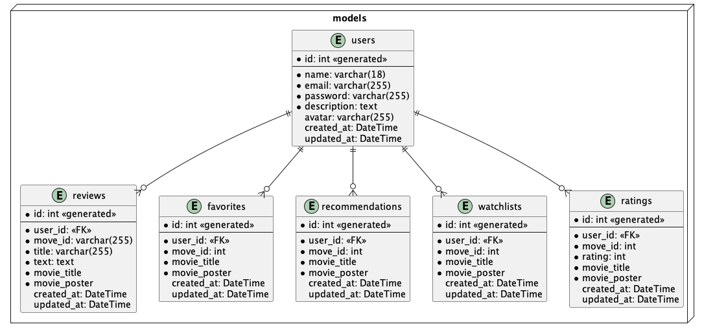
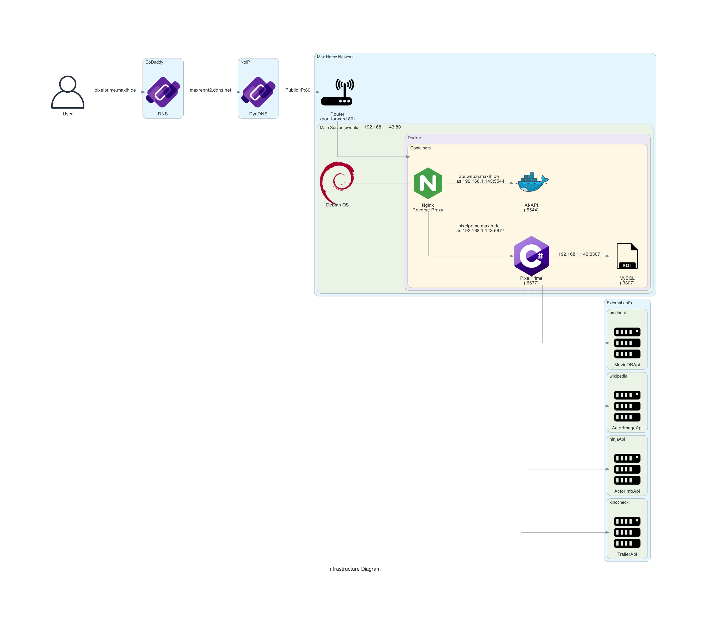

# Technical Concept: PixelPrime

## Overview
The project uses an API to retrieve movies that users can rate and add to their favorites. Users can also add movies to a “watch list” and receive recommendations from our AI server.

## Features
- Search for movies
- Rate movies
- Top Rated Movies List
- Movie Recommendations
- User Profile
- Login/Register
- Statisics
- Watchlist
- Movie info page (+ movie trailer)
- Comments to movies

## Architecture
The project is made in C# MVC

### Front-end
- HTML
- CSS
- JS
- C#
- Bootstrap

### Back-end
- C# MVC

### Database
- MySql container

### Database Modell

### External Services/APIs
- Movie API: 
https://www.omdbapi.com/

## Security Considerations
- user auth
- server behind a firewall and revers proxs

## Deployment and Hosting
Hosted on [Maximilian Huber](https://github.com/maxiboy441)'s home server which is based on debian.

## Infrastructure diagramm 

## Future Enhancements
- Use of AI features (recommendations with diffrent weighting) api: api.webai.maxih.de

### Used Packages
- ASP.NET Core Identity: For handling user authentication and authorization.
- Entity Framework Core (EF Core): For database interactions and ORM capabilities.

## TODO's
| Description    |
| -------- |
| ASP.NET Core Identity Instalation   |
| Entity Framework Core |
| User model  |
| Reviews Model |
| Favorites Model   |
| Watchlist Model   |
| Ratings Model   |
| User controller  |
| Reviews controller |
| Favorites controller   |
| Watchlist controller   |
| Ratings controller   |
| Navbar Component |
| Master layout |
| Purple button |
| Movies card component |
| Movie see button component |
| Login page |
| Register page |
